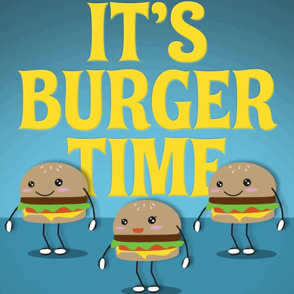
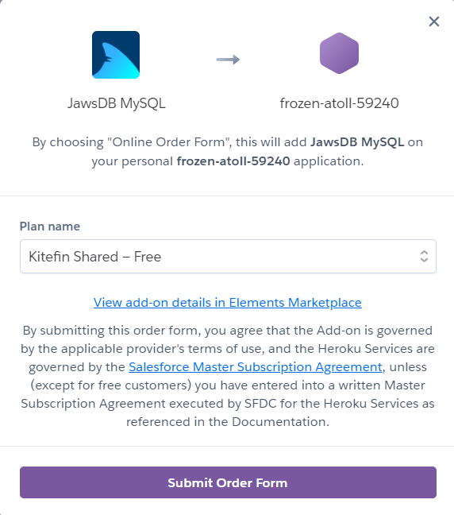
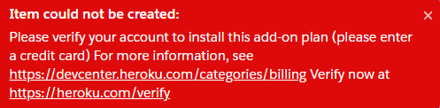

# Eat Da Burger!
  

## DEPLOYMENT (IMPORTANT! PLEASE READ)
Was unable to deploy properly as no free option was available that did not require an attached bank card, which unfortunately I am not willing to do.
 

 

## DESCRIPTION
This project demonstrates the MVC design paradigm in a fun and memorable way.

## TABLE OF CONTENTS
  - [Installation](#installation)
  - [Usage](#usage)
  - [License](#license)
  - [Contribution](#contribution)
  - [Test](#test)
  - [Questions](#questions)

## INSTALLATION
In the terminal type: 'npm install' and press enter. 
Then type: 'npm install express-handlebars' and press enter.

## USAGE
In the terminal type: 'node server.js' and press enter.

## LICENSE
none

# TEST
N/A

## CONTRIBUTION
Desmond Aldridge

## QUESTIONS
For further questions please contact me:
 
 
GitHub: https://github.com/DesmondAldridge
 
Email: desmondaldridge@gmail.com